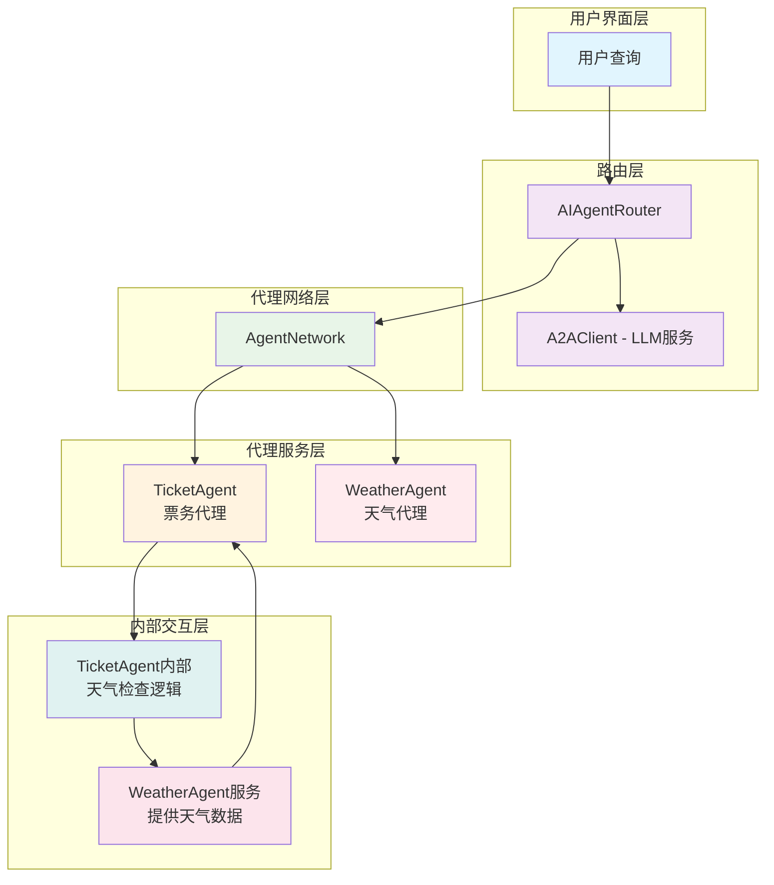
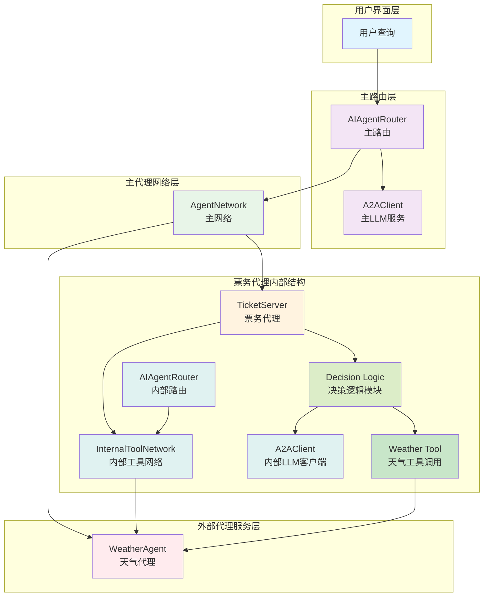

# A2A智能代理系统架构图

## 旧架构（硬编码调用）

## 新架构（基于大模型智能决策）

## 系统流程说明

### 旧架构流程
1. **用户查询**：用户发起查询请求
2. **智能路由**：AIAgentRouter根据查询内容智能选择合适的代理
3. **代理网络**：管理所有可用的代理服务
4. **票务代理**：处理票务预订请求，但在处理前会检查天气条件
5. **内部交互**：票务代理在处理票务前会主动调用天气代理获取天气信息

### 新架构流程
1. **用户查询**：用户发起查询请求
2. **主路由**：AIAgentRouter根据查询内容路由到合适代理
3. **票务代理内部决策**：使用内部LLM客户端进行智能决策
4. **智能判断**：决策逻辑模块判断是否需要调用天气工具
5. **内部工具调用**：如果需要，通过内部工具网络调用天气代理
6. **结果整合**：根据天气信息和票务需求生成最终结果

## 关键特性

- **智能决策**：票务代理使用大模型智能判断是否需要获取天气信息
- **动态调用**：仅在必要时才调用天气工具，避免不必要的资源消耗
- **内部工具网络**：票务代理内部维护独立的工具网络
- **灵活扩展**：易于添加其他类型的工具和服务
- **系统优化**：减少硬编码依赖，提升系统灵活性